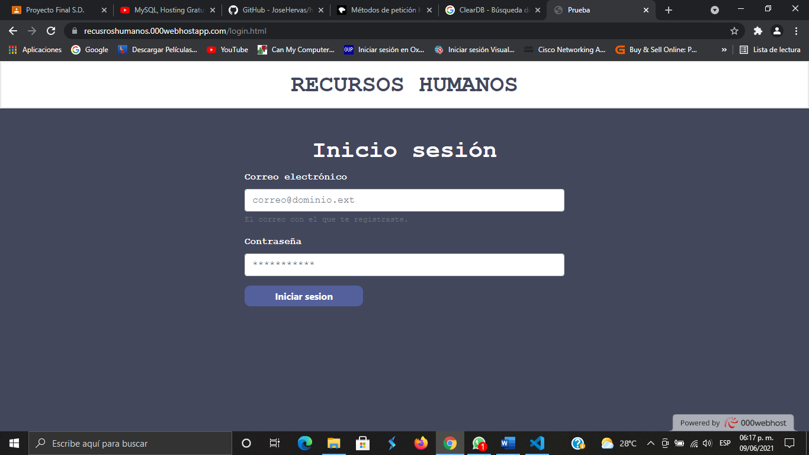

# Human Resources API

#### API REST corporativa para gestionar nuestra base de datos de empleados.

En este proyecto se creará una API para ayudarnos a controlar los registros de los empleados de la empresa en el área de Recursos Humanos la cual su principal función es un sistema que les permita realizar la administración de los empleados (altas, bajas, consultas y cambios) únicamente a ciertos usuarios dados de alta en el sistema. 

La URL base de nuestra API es la siguiente: 

https://recusroshumanos.000webhostapp.com/Interfaz.html

Para poder usar la API solo tendra que ir al link que se mostro anteriormente

De cada usuario registrado se guarda la siguiente información:
-	Usuario
-	Email
-	Contraseña

De cada empleado se guarda la siguiente información:
-	id
-	Nombre
-	Apellidos
-	Teléfono
-	Email
-	Dirección


#### ¿Cómo usar la API?

##### Manual de Usuario

Entrar al enlace de la Api mostrado anteriormente

Antes de que pueda acceder a la administración de los empleados tendrá que primero logiarse, Si no está logiado entonces no podrá acceder a la interfaz. A continuación, se mostrará algunas de las funciones de la interfaz:

- Primero Inicie sesión si esque la empresa le brindo un usuario y una clave



- Si la empresa le da acceso a la tabla de los empleados podra registrar un nuevo usuario, esta se encuentra en la parte superior de la intefaz de la API, esto se hizo para que no cualquier persona pueda registrarse en nuestra API.


Al iniciar en la API de recursos Humanos tendrá acceso a la tabla la cual se muestra la lista de empleados que podrá:
- Agregar empleados a la base de datos. (Botón "Agregar Empleado")
- Modificar datos de los empleados. (Botón "Actualiza Empleado")
- Eliminar empleados en la base de datos. (Botón "Borrar Empleado ")
- Si la empresa te da acceso podrás Registrar nuevo usuario. (Botón "Registrar Usuario")


##### Manual de Administrador

La API para la tabla user dispone de 3 métodos de petición, que se corresponden en la carpeta routes

- Una llamada GET al '/user' devuelve la información de todos los usuarios registrados en la base de datos.


- Una llamada POST "/signin" permite registrar un nuevo usuario en la base de datos. Para poder hacerlo, debes redirigir la ruta en un archivo signin.js, la cual le dará acceso al token y las funciones de repuesta de la API.


- Una llamada POST "/login" permite logiarse y tener acceso a la interfaz de la administración de base de datos. Para poder hacerlo, debes redirigir la ruta en un archivo login.js, la cual le dará acceso al token y las funciones de repuesta de la API.


La API para la tabla empleados dispone de 4 métodos de petición, que se corresponden en la carpeta routes

- Una llamada GET al '/empleados' devuelve la información de todos los empleados de la base de datos en forma de tabla


- Una llamada POST “/insert" permite registrar un nuevo empleado en la base de datos. Para poder hacerlo, debes redirigir la ruta en un archivo insert.js, la cual le dará acceso al token y las funciones de repuesta de la API.


- Una llamada DELETE "/:id([0-9]{1,3})" permite borrar un empleado de la base de datos. Para poder hacerlo, debes redirigir la ruta en un archivo delete.js, la cual le dará acceso al token y las funciones de repuesta de la API.


- Una llamada PUT al "/:id([0-9]{1,3})" permite editar la información de un empleado ya registrado previamente en la base de datos. Para poder hacerlo, debes redirigir la ruta en un archivo update.js, la cual le dará acceso al token y las funciones de repuesta de la API.


```json
"empleados": [{ 
        "id": 1,
        "name": "Luis",
        "last_name": "Montes Moreno",
        "phone": "4426008745",
        "email": "Luis.oz@outlook.com",
        "direction": "Av. de la Luz"

    }
```
Si tiene alguna duda al respecto del codigo puede contactar con Daniel Ibarra Maldonado por medio de la red social Facebook: https://www.facebook.com/saed.maldonado.9 


